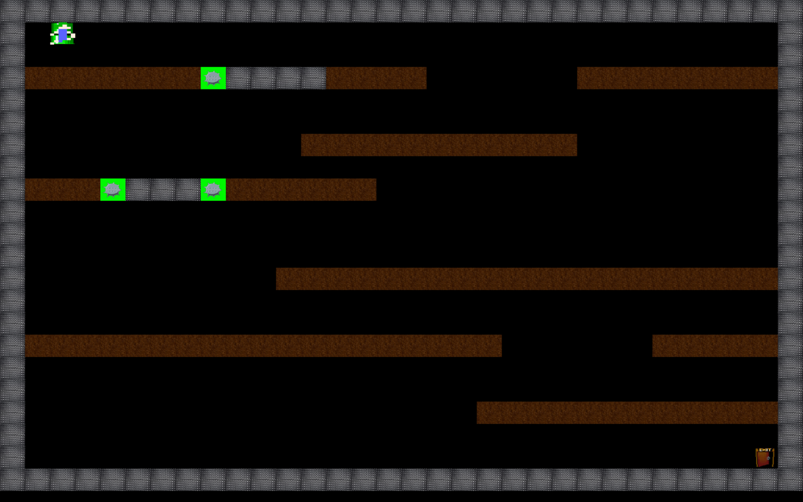

# Rapport du projet Lemmings

## Manuel d'utilisation

### Organisation du projet

Vous trouverez dans le projet les répertoires :

* **app** : qui contient le point d'entrée du programme (le *main*). 
* **assets** : qui contient les *images* formant l'interface graphique.
* **lib** : qui contient une base de divers niveaux.
* **src** : qui contient le code source du projet.
* **test** : qui contient l'ensemble des tests du projet.

### Creation d'un niveau

Pour créer un niveau, chaque case doit correspondre à une des lettres :

* **X** : pour une case en métal.
* **0** : pour une case en terre.
* **E** : pour une entrée.
* **S** : pour une sortie.
* **M** : pour une mine.
* **Espace** : pour une case vide.

Et le niveau doit respecter certaines propriétés :

* Les bords du niveau doivent être en métal.
* Le niveau possède exactement une entrée et une sortie.
* L'entrée se trouve au dessus d'une case vide.
* La sortie se trouve au dessus d'une case en métal.
* Toutes les coordonnées comprise entre 0 et la hauteur/largeur du niveau sont associées à une case et réciproquement.
* Le niveau doit être écrit dans un fichier text et donné en argument lors du lancement de l'application.

Voici un exemple de niveau valide :
```
XXXXXXXXXXXXXXXXXXXXXXXXXXXXXXXX
X E                            X
X                              X
X0000000MXXXX0000      00000000X
X                              X
X                              X
X           00000000000        X
X                              X
X000MXXXM000000                X
X                              X
X                              X
X                              X
X          00000000000000000000X
X                              X
X                              X
X0000000000000000000      00000X
X                              X
X                              X
X                  000000000000X
X                              X
X                             SX
XXXXXXXXXXXXXXXXXXXXXXXXXXXXXXXX
```

### Lancement du jeu

Pour lancer le jeu, il suffit de lancer la commande `stack run lib/XXXX.txt` (remplacer `XXXX.txt` par un nom de fichier valide).

### Comment jouer 

Pour modifier le comportement d'un *lemming*, il suffit de faire un click de souris dessus et appuyez sur une des touches :

* **w** : le lemming devient un *Demineur*, dès qu'il passe sur une mine, il la désactive et redevient *Marcheur*
* **x** : le lemming devient un *Exploseur*, il explose en détruisant toutes les cases en *terre* qui l'entourent et tue les lemmings qui sont à côté de lui.
* **c** : le lemming devient un *Creuseur*, si la case du bas à côté de lui est en *terre* il la détruit.
* **v** : le lemming devient un *Bloqueur*, il empêche les autres lemmings de passer pendant 8 tours de jeu.
* **b** : le lemming devient un *Constructeur*, si la case à côté de lui est vide, il pose un bloque en *terre*.
* **n** : le lemming devient un *Boucheur*, il bouche tout les vides sur lesquels il passe jusqu'à vider son inventaire (pour changer la taille de son inventaire, changer la valeur de retour de `poseMax`).
* **Esc** : pour quitter le jeu.

### Tests

Pour lancer les tests il suffit de lancer la commande `stack test`.


## Presentation du projet

L'objectif du projet est la création d'un "*Lemmings*" en *Haskell* **sur**, en 2D en utilisant la bibliothèque *SDL2*.

Dans une map, des lemmings sont générés et le joueur doit faire en sorte d'en conduire le maximum à la sortie en utilisant leurs différents potentiels au bon moment et au bon endroit.

Si tout les lemmings meurent, la partie se termine et le joueur a perdu, sinon, si il arrive à en sauver quelques-uns, on parle de victoire partielle, sinon, si tout les lemmings sont sauvés, alors le joueur a gagné.

Au lancement du jeu une interface graphique s'ouvre, quand on lance le niveau donné ci-dessus, on a l'affichage suivant :



## Propositions

### Coord

Invariant du type *Coord* :

* Les coordonnées sont positives.
* Un déplacement à gauche puis à droite revient à la même coordonnée.
* Un déplacement à droite puis à gauche revient à la même coordonnée.
* Un déplacement à gauche puis en haut revient à aller à la coordonnée d'en haut à gauche.
* Un déplacement à droite puis en bas revient à aller à la coordonnée d'en bas à droite.

Post-condition des fonctions :

* initCoord : la coordonnée instanciée respecte l'invariant.

### Environnement

Invariants du type *Environnement* :

* Chaque entité a un identifiant positif et respecte l'invariant de son lemming.
* Chaque entité présente dans la liste des entités de l'environnement est présente dans au moins une case de l'environnement.
* Chaque entité présente dans une case de l'environnement est présente dans la liste de entités de l'environnement.

Pré-conditions des fonctions :

* makeEnvironnement : la hauteur et la largeur sont strictement positives.
* trouveIdEnvi : l'identifiant est positif.
* trouveIdSeq : l'identifiant est positif.
* trouveIdMap : l'identifiant est positif.
* appliqueIdSeq : l'identifiant est positif.
* appliqueIdEnv : l'identifiant est positif et l'environnement respecte ses invariants.
* enleveId : l'identifiant est positif.
* enleveEnvi : l'identifiant est positif.
* deplaceDansEnvironnement : l'identifiant est positif et la coordonnée et l'environnement respectent leurs invariants.
* ajouteEntite : l'entité et l'environnement respectent leurs invariants.
* tuerEntiteCase : la coordonnée et l'environnement respectent leurs invariants et le nombre de morts doit être positif.
* explosion : la coordonnée et l'environnement respectent leurs invariants.

Post-conditions des fonctions :

* makeEnvironnement : l'environnement respecte ses invariants.
* appliqueIdEnv : l'environnement respecte ses invariants.
* enleveId : l'identifiant n'est plus dans la sequence des entités et l'environnement respecte ses invariants.
* enleveEnvi : l'entité n'est plus dans l'environnement.
* deplaceDansEnvironnement : l'entité est dans la sequence correspondante à ses nouvelles coordonnées et l'environnement respecte ses invariants.
* ajouteEntite : l'entité a été ajouté à l'environnement et l'environnement respecte son invariant.
* tuerEntiteCase : l'environnement respecte ses invariants et le nombre de morts est supérieur à celui donné en argument.
* explosion : l'environnement respecte ses invariants, le nombre de morts est positif et toutes les sequence des cases qui entourent la coordonnée et la sequence de la coordonnée sont vides.

### Etat

Invariants du type *Etat* :

* l'invariant de son environnement est vérifié.
* l'invariant de son niveau est vérifié.
* le nombre total de lemmings est strictement supérieur à 0.

Pré-conditions des fonctions :

* makeEtat : le niveau respecte ses invariants.
* tourLemming : l'identifiant est positif et le lemming et l'état vérifie leurs invariants.
* tourEntite : l'identifiant est positif et l'état vérifie ses invariants.
* ajouterLemming : l'état vérifie ses invariants.
* tourEtat : le numéro du tour est positif et l'état vérifie ses invariants.
* selectLemming : l'identifiant est positif et l'état vérifie ses invariants.

Post-conditions des fonctions :

* makeEtat : l'etat respecte ses invariants.
* tourLemming : l'état vérifie ses invariants.
* tourEntite : l'état vérifie ses invariants.
* ajouterLemming : l'état vérifie ses invariants, le nombre de lemmings restants est decrémenté et des lemmings vivants incrémenté.
* tourEtat : l'état vérifie ses invariants.
* selectLemming : l'état vérifie ses invariants et le lemmings associé à l'identifiant est selectionné.

### Lemmings

Invariant du type *Lemmings* :

* l'invariant de ses coordonnées est vérifié.


### Niveau

Invariants du type *Niveau* :

* un niveau a exactement une entrée et une sortie.
* les bords du niveau sont en métal.
* l'entrée se trouve au dessus d'une case vide et la sortie au dessus d'une case en métal.
* la hauteur et la largeur du niveau sont strictement positives.
* le niveau a au moins une case.


Pré-conditions des fonctions :

* supprimerCase : la case a détruire est de la terre.
* poserCase : la case est une case vide.
* activerMine : la case est une mine.
* desactiverMine : la case est une mine activée.
* bloquer : la case est vide.
* debloquer : la case bloquée

Post-conditions des fonctions :

* readNiveau : le niveau créé vérifie son invariant.
* supprimerCase : la case supprimée est une case Vide.
* poserCase : la case est une case de terre.
* activerMine : la case est une mine activée.
* desactiverMine : la case est une case de terre.
* exploserCase : les 8 cases autours et la case elle même ne sont pas des cases de terre.
* bloquer : la case est bloquée
* debloquer : la case debloquée


## Tests

......


## Implementations

### Base

Pour l’implémentation du jeu de base on s'est basés sur le sujet du partiel, la solution proposée pendant le *TD 6* ainsi que le *TME 6* et qui nous a donné la structure suivante :

* un module **Coord** qui contient le type *Coord* qui représente une coordonnée dans le niveau et le type *Deplacement* qui représente les différents déplacements possibles ainsi que la classe **Placable**.
* un module **Environnement** qui contient les types et fonctions implémentants l'environnement du jeu c'est à dire les entités et ces mêmes entités dans un niveau donnée à un instant donnée.
* un module **Etat** qui contient les types et fonctions implémentants le moteur du jeu : un environnement, un niveau, le nombre de lemmings à générer, le nombre de lemmings vivants et le nombre de lemmings sauvés.
* le module **Keyboard** du *TME 6*.
* un module **Lemmings** qui gère les lemmings.
* un module **Moteur** qui fait *tourner* le jeu.
* un module **Mouse** qui gère les évenements liés à la souris.
* un module **Niveau** qui implémente les types et les fonctions de la carte du jeu.
* le module **Sprite** du *TME 6*.
* le module **SpriteMap** du *TME 6*.
* le module **TextureMap** du *TME 6*.
* un module *Main* qui contient toute la partie effet de bord du projet, on charge les assets, on initialise la carte, l'environnement, l'etat... etc et on lance la boucle du jeu.

Et pour la version de base on avait 3 types de Lemmings : le Marcheur, le Tombeur et le Mort.

#### Points forts

Un des principaux points forts qu'on a trouvé pertinent dans notre projet est la sécurité du code vérifiée grâce aux tests *QuickCheck* expliqué plus haut ainsi que la couverture de toutes les fonctions par des préconditions et des postconditions.

Le second point fort est lors des tour de jeux où on a bien séparé tous les cas de Lemmings possible par leurs *type* ainsi que leurs *direction* si ils ont en une (accessible [ici](https://gitlab.com/SofianeBelkhir/lemmings/-/blob/1eefc6ddfd809b6d3ca5f8fbd4abda11bf0de95b/src/Etat.hs#L48).)

ce qui nous a permis de déboguer assez rapidement le code lorsqu'on voyait un comportement anormal d'un lemmings su l'interface graphique, parce que là, on avait qu'à suivre ses traces d'appels en partant de la fonction `tourLemmings`qui lui est associée.


### Extensions 


#### Lemmings

Par rapport au jeu de base, on a ajouté de nouveau types de lemmings et qui sont :

* Le Creuseur : (que vous pouvez activer avec la touche *C*) qui creuse un trou vertical (sur sa gauche ou sa droite, ça dépend de sa direction), puis commence à marcher dans le sens inverse (pour ne pas tomber dans le trou qu'il a creusé).
* Le Constructeur : (que vous pouvez activer avec la touche *B*) qui pose un bloc de terre (sur sa gauche ou sa droite, ça dépend de sa direction), puis commence à marcher dans le sens inverse (il est bloqué par la case qu'il a posé).
* L'Exploseur : (que vous pouvez activer avec la touche *X*) qui explose après 8 tour de jeu en tuant tout les lemmings qui l'entourent et en détruisant toutes les cases en terre autour de lui.
* Le Bloqueur : (que vous pouvez activer avec la touche *V*) qui agit comme un mur quand les lemmings essaie de passer pendant 8 tour de jeu, puis continue à marcher dans sa direction d'avant.
* Le Boucheur : (que vous pouvez activer avec la touche *N*) qui bouche tout les vides sur lesquels il passe jusqu'à vider son inventaire (pour changer la taille de son inventaire, changer la valeur de retour de `poseMax`) en posant des cases en terre quand il arrive au dessus d'une case vide.
* Le Demineur : (que vous pouvez activer avec la touche *W*) qui désactive une mine quand il marche sur elle puis continue de marcher dans sa direction, on le reconnait grâce à son chapeau blanc sur l'interface graphique.
* Le Brulé : (qui s'active tout seul) qui s'active quand le lemming marche sur une mine avant de mourir.

#### Niveau

Comme on a aussi ajouté au Niveau deux nouveaux types de case :

* Les mines : quand un lemming (autre que le demineur) marche sur elle, elle se transforme en MineActive, mais quand c'est un demineur qui passe au dessus il la remplace par une case de terre.
* Les mines actives : quand une mine est activée elle devient mine active pendant 8 tour de boucle par défaut puis explose et tue le lemming et se transforme en case vide.

#### Points forts

L'ajout des nouvelles extensions s'inspire fortement de celles d'avant où il suffisait de modifier juste le comportement des lemmings, même si celà à ajouter beaucoup de cas au `tourLemming` et nous a obligé à modifier le comportement de ceux d'avant pour les adapter aux nouvelles extensions (le code est accessible [ici](https://gitlab.com/SofianeBelkhir/lemmings/-/blob/master/src/Etat.hs#L63).)
### Difficultés

On a rencontré deux difficultés importantes lors du développement de notre projet :

Lors de l'explosion d'un lemming *Exploseur*, on doit [tuer tout les lemmings qu'il y a sur les 9 cases](https://gitlab.com/SofianeBelkhir/lemmings/-/blob/master/src/Etat.hs#L63) dont [la précondition](https://gitlab.com/SofianeBelkhir/lemmings/-/blob/master/src/Environnement.hs#L215) est assez longue et en même temps [vider ces cases du niveau](tuer tout les lemmings qu'il y a sur les 9 cases).

La deuxième difficulté a été de trouver des asserts intéressants pour l'interface graphique, et après quelques heures de recherche, on a réussi à trouver une base d'assets en *gif* accssible [ici](https://github.com/radare/fxos-app-lemmings.git) où on s'est servi et on a dû convertir image par image en *bmp*.

La deuxième difficulté concernant l'interface graphique et la dernière du projet a été la gestion de l'interface pour essayer de donner l'impression au joueur que le lemmings bouge à chaque tour de boucle au lieu de juste mettre un lemming statique qui glisse, donc pour le faire on a dû charger 8 images pour chaque type de lemmings (type + direction) ainsi que des assets pour mettre en avant le marcheur qui est selectionné (en l'encadrant en rouge pour qu'il soit bien visible). 

Et même si l'interface est assez basique, mais on est assez fiers du résultat final.


